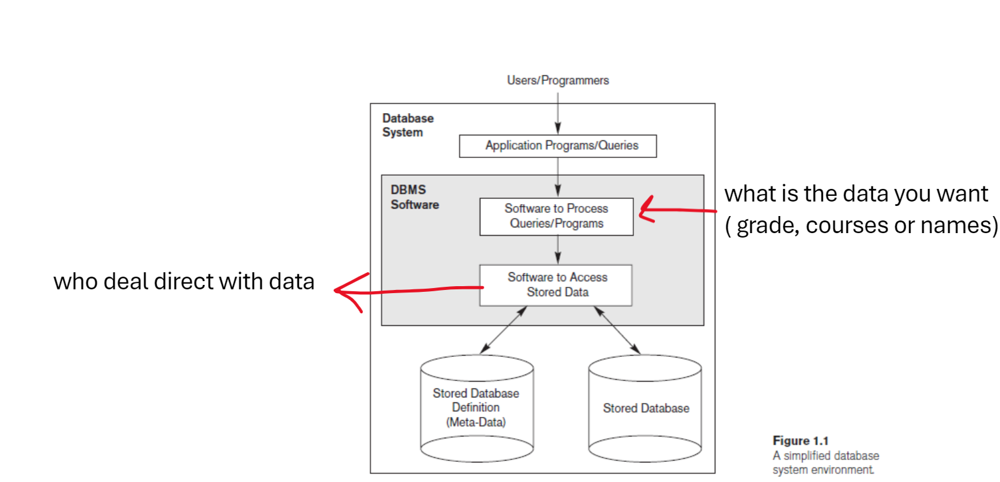

- **chapter one**
    - introduction
    - Example
    - characteristics of database approach
    - actors on the scene
    - worker behind the scene
    - advantage of using DBMS approach
    
    - **Database**
        1. A database is a collection of related data. By data, we mean known facts that can be recorded and that have implicit meaning. 
        2. For example, consider the names, telephone numbers, and addresses of the people you know. Nowadays, this data is typically stored in mobile phones, which have their own simple database software. This data can also be recorded in an indexed address book or stored on a hard drive, using a personal computer and software such as Microsoft Access or Excel.
        3. It is a part of our world ( mini-world ) or sometimes called Universe Of Discourse (UOD) ⇒ any change in the world reflected in the database
        4. database has relationship between each other it is a  logically coherent of data with some inherent meaning
        5. it is designed for specific purpose
   
    - **Example**
        1. **Traditional database application**
            - store textual or numerical data
        2. **Multimedia database**
            - Store image, audio and video
        3. **Geographic information system (GIS)**
            - store and analyze maps, weather data and satellite images
        4. **Data warehouses and online analytical processing (OLAP) system**
            - extract and analyze information from a big database to support make decision  ex ⇒( for bank as )
        
    
    **Database Management System ( DBMS )**
    
    <aside>
    💡 It is a collection of program that enables user to create or maintain a database.
    
    It facilitates the processes of ⇒Defining, constructing, manipulating (edit and use) and sharing among a lot of users and application.  
    
    one of important function of DBMS is ⇒ protecting data from any crash or security protection against unauthorized access.
    
    It has an ability to maintain database during the lifecycle of it as it may may larger than before
    
    </aside>
    
    1. **Defining** ⇒ it is involve the type of data, structure (which data will be stored with other data), constraints (القيود), it also stored in a database catalog or dictionary; it is called meta-dat (data-data) data about data.
    2. **constructing** ⇒ It is the process of store data in storage medium that controlled by DBMS.
    3. **manipulating**  ⇒ updating data and edit it in case any change in mini-world.
    4. **sharing** ⇒ share data with users to use it.
    
    
    
    
    
    ## Characteristics of the Database Approach
    
    1. **File Approach**
        - Program-data dependence ⇒ the same data for each file
        - Duplicate Data ⇒ different program has separate copies of same data
        - Limited data sharing
        - Lengthy development sharing
        - Excessive Program maintenance
        

        
        **Database is the solution of file approach**
        
        - central repository of shared data
        - Data is manage by controlling agent
        - Stored in a standardized, convenient (no copies, comfortable) from
        
    2. **Database Approach**
        - Self-Describing Nature of a data base ⇒ your data an it’s definition are in database (meta-data)
        - Insulation between data and program ⇒ edit in data not an edit in program (separation between them) **Program-data independence**
            - Data Abstraction ⇒ it is the way which make the **Program-data independence (program-operation independence) basic information**
            - Data Model it used by data abstraction to do it’s job
        - Support of Multiple Views of data ⇒ each user has it’s own view of data
        - Sharing of data ⇒ the DBMS must include concurrency control which manage not to be any conflict
    

    ## Actors on the scene
    
    1. Database Administrator (DBA)
    2. Database Designer ⇒ which data will store and how to do it and he communicate with user
    3. End user
    4. System Analysts and Application Programmer ⇒ analysis and implement the database test, debug, document and maintain 
    

    ## Worker behind the scene
    
    1. DBMS system designer and implementer ⇒ design and implement DBMS module and interface as a software package
    2. Tool developer ⇒ design and implement tools
    3. Operators and maintenance personnel

    
    ## Advantages of Using the DBMS Approach
    
    - Controlling Redundancy ⇒ no repeat using data normalization
    - Restricting Unauthorized Access ⇒ not any one can see all data
    - Backup and recovery ⇒ copy of your data incase there is any problem
    - Graphical user interface
    - Can apply your constrains
    

        
    - Important
        - Data is collection of information data ≠ information
        - **Transaction** it cause some data to be read or written into the data base
        - Any transaction is separated from another one
        - **Atomicity it is a property to insure if all operation in the transaction executed or not (either all done or not)**
            
            
    - Definition
    - ***Database*** is a logical, consistent and organized collection of data that it can easily be accessed, managed and updated.
    - ***Normalization*** is the process of designing a database so that the data is stored in a way that is efficient and easy to maintain.