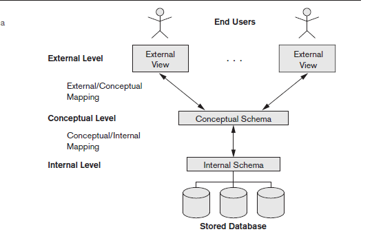
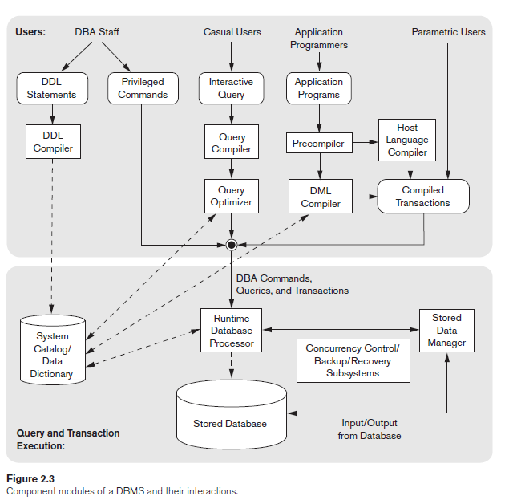
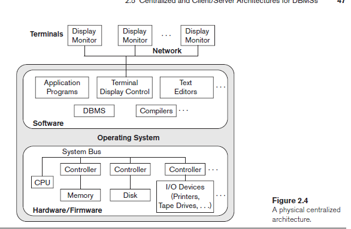
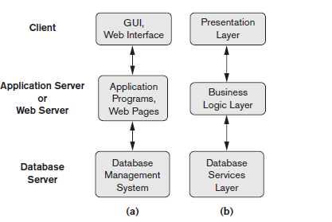

- **Chapter two**
    - Data Models, Schemas and instances
    - Three-Schema Architecture and data independence
    - Database language and interfaces
    - Database System environment
    - Centralized and Client/Server Architectures for DBMSs
    - Classification of DBMS
    
    ## Data Models, Schemas and instances
    
    1. Database approach is that it provides some
    level of data abstraction.
    2. To achieve this abstraction ⇒ we use data model ⇒ a collection of concepts that can be used to describe the structure (data types, relationships, and constraints that apply to the data and basic operation to update the data) of a database 
    
    ### Categories of Data Models
    
    categorize according to the types of concepts they use to describe the database structure.
    
    1. High-level || conceptual data models → provide concept that are close to the user
    2. low-level || physical data models → provide concept that describe the details of how data store the data to computer specialists
    3. representational || implementation data model → between the other two models hide many details of data
    storage on disk but can be implemented on a computer system directly.
        - such as Relational data model, the network and hierarchical models
    
    Data model use concept of such as entities, attributes and relationships
    
    - Entities ⇒ it represent areal word object such as employee
    - Attributes ⇒ some property about entities
    - Relationship ⇒ relation between two entities or more
    
    To access data efficient we use Access path ⇒ it is a structure used to search like Index method → it allow access data directly using an index term or keyword
    
    ## Schemas, Instances, and Database State
    
    It is important to know the different between database and database description.
    
    Database Schemas ⇒ it is the description of the database, specified during database design and is not expected to change frequently, it is displaying as diagram Schema Diagram ⇒ show the structure of data
    
    Database state || snapshot || occurrences || instances ⇒ it is the data in database at particular moment
    
    ### **Three-Schema Architecture and Data Independence**
    
    1. **Three-Schema Architecture**
        - The goal of it is to separate the user application from the physical database
        - Schema is defined into three levels
            1. Internal level == low level ⇒ uses physical storage , it has an internal schema, describe complete data and access path.
            2. The conceptual level has a conceptual schema ⇒ describe the structure and describing entities, data types, relationships, user operations, and constraints.
                - conceptual schema hide the details
                - representational data model is used to describe the conceptual schema when a database system is implemented.
            3. External Level || view level ⇒ includes a number of external schemas or user views. Each external schema describes the part of the database that a particular user group is interested in and hides the rest of the database from that user group. As in the previous level, each external schema is typically implemented using a representational data model, possibly based on an external schema design in a high-level conceptual data model.
    
    
    
    ## Data Independence
    
    You can edit Schema in one level without having to edit the higher level schema
    
    1. Logical data independence is the capacity to change the conceptual schema without having to change external schema.
    2. Physical data independence is the capacity to change the internal schema
    without having to change the conceptual schema
    
    ## DBMS Language
    
    - Data Definition language (DDL)
        - To Defines all schemas (build database)
    - Data manipulation language (DML)
        - Allow edit data, to interact with data
    - Storage Definition language (SDL)
        - Specifies the internal schema
    - View Definition language (VDL)
        - Specifies the external schema
        
    
    ## **The Database System Environment**
    
    ### DBMS Component Modules
    
    The database and DBMS catalog are usually stored on disk, access it is controlled by operating system which schedules read/write.
    
    Many DBMS have their own Buffer management module
    
     
    
    1. Buffer management module ⇒ it schedule the read/write from disk and increase the performance.
    2. Stored data manager module ⇒ it is control the access to DBMS information stored in the disk
    - Buffer ⇒ place I chose to do something
    
    
    
    ## Database System Utilities
    
    It is a software help DBA to manage the database system, it have the following types of functions:
    
    1. Loading ⇒ is used to load existing data files into database
    2. Backup ⇒ create backup of database onto tape or other mass storage medium… increment backup is to back the new data only it is complicated but save the storage
    3.  DB storage reorganization ⇒ This utility can be used to reorganize a
    set of database files into different file organizations and create new access paths to improve performance.
    4. Performance monitoring ⇒ Such a utility monitors database usage and provides statistics to the DBA. The DBA uses the statistics in making decisions such as whether or not to reorganize files or whether to add or drop indexes to improve performance.
    
    ## Centralized and Client/Server Architectures for DBMSs
    
    1. Centralized DBMSs Architecture
        - Architectures for DBMSs have followed trends similar to those for general computer
        system architectures. Older architectures used mainframe computers to provide
        the main processing for all system functions, including user application
        programs and user interface programs, as well as all the DBMS functionality. The
        reason was that in older systems, most users accessed the DBMS via computer terminals
        that did not have processing power and only provided display capabilities.
        Therefore, all processing was performed remotely on the computer system housing
        the DBMS, and only display information and controls were sent from the computer
        to the display terminals, which were connected to the central computer via various
        types of communications networks.
        
        
        
    2. Basic Client/Server Architectures
        - many server for each job ⇒ web server, file server and so on
    
    ## Two-Tier Client/Server Architectures for DBMSs
    
     In relational database management systems (RDBMSs), many of which started
    as centralized systems, the system components that were first moved to the
    client side were the user interface and application programs. Because SQL (see Chapters 6 and 7) provided a standard language for RDBMSs, this created a logical dividing point between client and server. Hence, the query and transaction functionality related to SQL processing remained on the server side. In such an architecture, the server is often called a query server or transaction server because it provides these two functionalities. In an RDBMS, the server is also often called an SQL server.
    
    ODBC is the connection between client and DBMS
    
    ## Three-Tier and n-Tier Architectures for Web Applications
    
    Many Web applications use an architecture called the three-tier architecture, which adds an intermediate layer between the client and the database server
    