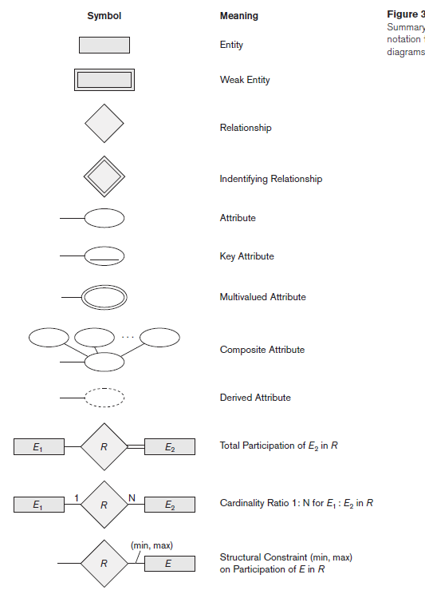
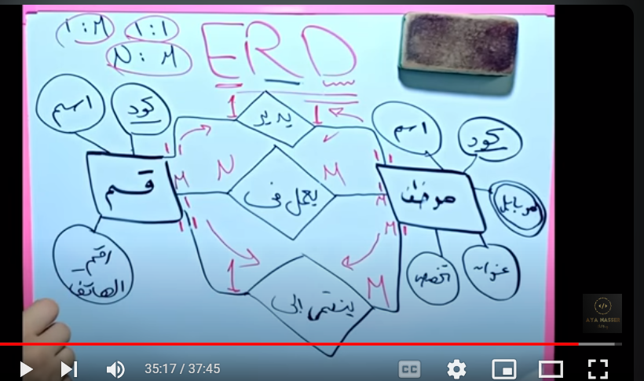

# Entity Relationship Diagram (ERD)

- It is a simple draw to describe the database structure The First step
- Entity ⇒ the real object which I can describe it with some properties like student, project.
    - Weak Entity ⇒ like order dependent on strong entity take the same code from strong entity (don’t has key)
    - Strong Entity ⇒ independent on him self has primary key ⇒it is a code to differ entity from another one (1251)
- Ever entity has his main Attributes
    - Simple attribute ⇒ each attribute is simple like name, ID (SSN)
    - Composite attribute ⇒ when I turn simple to many attributes like address (details)
    - Multi-value attribute ⇒ like phone have many numbers
    - Derived attribute ⇒ like age if you calculate it
    - Complex ⇒ multi-value + Composite
    
    
    
- Relationship ⇒ it connect between two entity… many relation can connect two entity
    - 1 : 1 (one to one) ⇒
    - 1 : M (one to many) ⇒
    - M : N (many to many) ⇒
    - Binary ⇒ two entity
    - Ternary ⇒ three entity
    - Recursive ⇒ the same entity
        
        
        

## ERD to Schema

1. Each entity has table
2. Each multi-value attribute has table
3. Each M : N relation has table
4. Each 1 : M ⇒ I will take primary key from 1 to M
5. Each 1 : 1 ⇒ I will take primary key from partial participation to total participation (min to max)

- connect each code to his entity
- Derived entity don’t write in the table
- to determine the kind of participation (حل لازم كل قسم يديره موظف لو اه بيقي اشتراك كل)
- if you change a primary key from it’s entity it will be foreign key